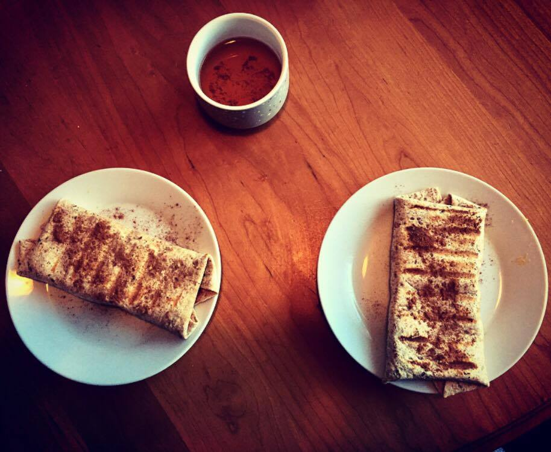

# Recipes

> A collection of awesome recipes

## Table of Contents
- [Entrees](#entrees)
- [Lunches](#lunches)
- [Sides](#sides)
- [Snacks](#snacks)

## Entrees

#### Grilled Tilapia with Mango Salsa

> Based on the [recipe](http://allrecipes.com/recipe/166771/grilled-tilapia-with-mango-salsa) by Naomi Witzke.

| Type | Count |
|:-:|:-:|
| Marinate | 60 |
| Prep | 45 |
| Cook | 10 |
| **Total** | **115** |

##### Ingredients

> Serves 2

| Ingredient | Quantity |
|:-:|:-:|
| extra-virgin olive oil | 1/3 cup |
| lemon | 1 |
| fresh parsley | 1 tablespoon |
| garlic clove | 1 |
| dried basil | 1 teaspoon |
| ground black pepper | 1 teaspoon |
| salt | 1/2 teaspoon |
| tilapia fillets | 2 (6 ounce) |
| mango | 1 |
| orange bell pepper | 1 |
| red onion | 1/4 |
| chopped fresh cilantro | 1 tablespoon |
| lime juice | 2 tablespoons |
| tomato | 1 |
| Maple mustard | 4 tbsp |

##### Instructions

1. In a bowl, combine the extra-virgin olive oil, juice from half of the lemon, minced parsley, minced garlic, minced basil, pepper, and salt. Mix with a whisk. Pour this marinade into a sealable plastic bag, along with the tilapia fillets, squeezing out excess air. Marinate for 1 hour
2. Next, finely dice the orange pepper, red onion, and tomato. Also chop up the cilantro. Prepare the mango salsa by combining the mango, orange bell pepper, red onion, tomato, and cilantro in a bowl. Add the juice from the lime and 1/4 of the lemon into the bowl, and toss well. Season with salt and pepper, if desired.
3. Fry the tilapia on medium high heat after removing the tilapia from and discarding the marinade. Shake off excess marinade on the tilapia. Serve covered with maple mustard and mango salsa.

## Lunches

#### Apple Bacon Quesadilla

| Type | Count |
|:-:|:-:|
| Prep | 15 |
| Cook | 5 |
| **Total** | **20** |

##### Ingredients

> Serves 1

| Ingredient | Quantity |
|:-:|:-:|
| apple | 1 |
| wrap | 2 |
| peanut butter | 4 tablespoons |
| honey | 2 tablespoons |
| bacon | 4 strips |
| marble cheese | 30 grams |

##### Instructions

1. Cook the strips of bacon in a frying pan on the stove.
2. Peel the apple, then cut it into 8 pieces.
3. Slice the cheese into 4 slices
4. Turn the oven on to broil on high.
5. Place the wraps on a greased, or aluminum foil-covered, baking sheet.
6. Put 4 apple slices on half of each wrap. Place the bacon strips on top of the apples, followed next by the cheese slices. Spread peanut butter and honey on the other half of the wraps and fold them closed.
7. Put the baking sheet with the quesadillas into the oven and broil for 5 minutes. Remove and serve hot!

## Sides

## Snacks

#### Almost Healthy Beaver Tails

> Inspired by the Canadian classic, [Beaver Tails](http://beavertails.com/en/)

| Type | Count |
|:-:|:-:|
| Prep | 10 |
| Cook | 5 |
| **Total** | **15** |

##### Ingredients

> Serves 2

| Ingredient | Quantity |
|:-:|:-:|
| Banana | 1 |
| Wrap | 2 |
| Nutella | 2 tbsps |
| Peanut Butter | 2 tbsps |
| Cinammon | 1 tsp |

##### Instructions

1. Spread peanut butter and Nutella over the wrap
2. Slice the banana into thin circular chunks. Place on the middle of the wrap.
3. Fold the wrap as wanted. Use a pannini press to seal the wraps if desired.
4. Sprinkle cinammon on top of sealed wrap to add flavor.

